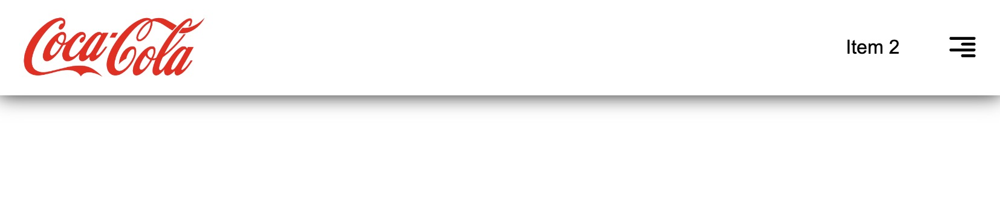
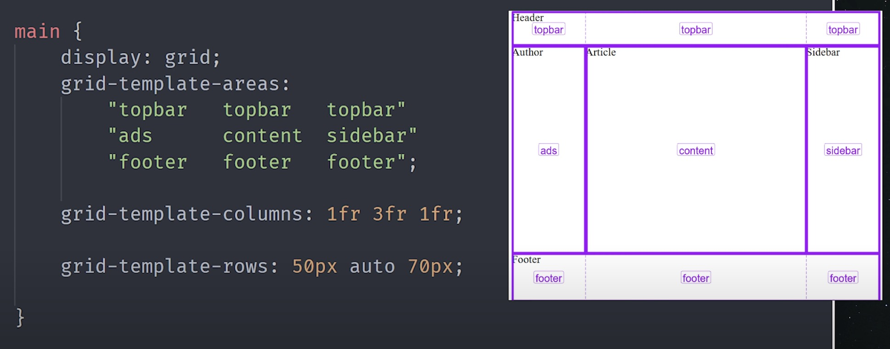

# 2. Lenguajes y Herramientas para el Desarrollo de Interfaces

### 1. **HTML y CSS: La Base de las Interfaces Web**

**HTML (HyperText Markup Language) y CSS (Cascading Style Sheets)** son los pilares fundamentales para construir y diseñar interfaces web. Aquí se exploran sus conceptos avanzados y técnicas esenciales:

**HTML Semántico:**
- **Definición y Importancia:** HTML semántico se refiere al uso de etiquetas HTML que tienen un significado claro sobre el contenido que envuelven. Utilizar etiquetas semánticas como `<header>`, `<footer>`, `<article>`, `<section>`, y `<nav>` mejora la accesibilidad, la estructura y el SEO (Search Engine Optimization) de una página web.
- **Beneficios:** Proporciona una mejor comprensión del contenido por parte de los navegadores y motores de búsqueda, y facilita la colaboración entre desarrolladores al hacer el código más legible y fácil de mantener.
- **Ejemplo:** En lugar de usar `<div>` para todos los elementos, se deben utilizar `<header>` para el encabezado, `<nav>` para la navegación, y `<footer>` para el pie de página.

### 2. **CSS Avanzado:**
#### **Flexbox:**
  - **Definición:** Flexbox es un modelo de diseño de CSS que facilita la alineación y distribución de elementos en un contenedor, incluso cuando su tamaño es desconocido y/o dinámico.
  - **Características Clave:** Permite alinear elementos horizontal y verticalmente, distribuir el espacio de manera eficiente, y ajustar el tamaño de los elementos flexibles. 
  - **Uso:** Ideal para diseños de una sola dimensión (filas o columnas) y para crear layouts responsivos y adaptativos.
  - **Ejemplo de Código:**
    ```css
    .container {
      display: flex;
      justify-content: start;
      align-items: start;
      height: 100svh;
    }

    .item {
      width: 100px;
      height: 100px;
      background: lightblue;
      border: 1px solid blue;
      margin: 10px;
      display: flex;
      justify-content: center;
      align-items: center;
    }
    ```

  

  

  

##### **Ejemplo 1: Distribución Básica de Elementos en una Fila**

```html
<div class="flex-container">
  <div class="item">Elemento 1</div>
  <div class="item">Elemento 2</div>
  <div class="item">Elemento 3</div>
</div>
```

```css
.flex-container {
  display: flex;
  justify-content: space-between;
  align-items: center;
  background-color: #f0f0f0;
  padding: 10px;
}

.item {
  background-color: #ffcc00;
  padding: 20px;
  margin: 5px;
  flex: 1;
}
```
**Descripción:**
- `justify-content: space-between`: distribuye los elementos uniformemente, dejando el espacio extra entre ellos.
- `align-items: center`: alinea los elementos verticalmente en el centro del contenedor.

##### **Ejemplo 2: Diseño de Columna con Alineación de Elementos**

```html
<div class="flex-column">
  <div class="item">Elemento A</div>
  <div class="item">Elemento B</div>
  <div class="item">Elemento C</div>
</div>
```

```css
.flex-column {
  display: flex;
  flex-direction: column;
  justify-content: flex-start;
  align-items: stretch;
}
```
**Descripción:**
- `flex-direction: column`: organiza los elementos en una columna.
- `align-items: stretch`: estira los elementos para que ocupen el ancho completo disponible.

##### **Ejemplo 3: Flexbox con Elementos Flexibles y No Flexibles**

```html
<div class="flex-container">
  <div class="item">Flexible 1</div>
  <div class="item fixed">No Flexible</div>
  <div class="item">Flexible 2</div>
</div>
```

```css
.flex-container {
  display: flex;
}

.item {
  flex: 1;
  padding: 10px;
  background-color: #ffd700;
}

.fixed {
  flex: none;
  width: 200px;
  background-color: #ff4500;
}
```
**Descripción:**
- Los elementos con `flex: 1` crecen y ocupan el espacio disponible, mientras que el elemento con `flex: none` mantiene un tamaño fijo de 200px.

##### **Ejemplo 4: Reordenamiento de Elementos con Flexbox**

```html
<div class="flex-container">
  <div class="item" style="order: 2">Elemento 1</div>
  <div class="item" style="order: 1">Elemento 2</div>
  <div class="item" style="order: 3">Elemento 3</div>
</div>
```

```css
.flex-container {
  display: flex;
}
```
**Descripción:**
- `order`: cambia el orden visual de los elementos sin alterar el HTML. En este ejemplo, "Elemento 2" se mostrará primero aunque en el HTML aparezca después de "Elemento 1".


- **Toolbar con Flexbox:**



```html
<html>
<head>
  <style>
    body {
      margin: 0;
      font-family: arial;
    }
    .container {
      display: flex;
      justify-content: center;
      box-shadow: 0 0 16px #1e1e1e;
    }

    .item {
      height: 60px;
      margin: 10px 20px;
      display: flex;
      justify-content: center;
      align-items: center;
    }

    .item:first-child {
      flex: auto;
      justify-content: start;
    }
    .item {
      justify-content: center;
    }
    .link-pretty {
      text-decoration: none;
      color: black;
    }
    .link-pretty:hover {
      text-decoration: underline;
    }
    .menu {
      width: 24px;
    }
  </style>
</head>
<body>
  <div class="container">
    <div class="item">
      
    </div>
    <div class="item">
      <a class="link-pretty" href="https://google.es" target=_blank>Item 2</a>
    </div>
    <div class="item">
      <a class="link-pretty" href="https://google.es" target=_blank>
        
      </a>
    </div>
  </div>
</body>
</html>

```

#### **Grid Layout:**
  - **Definición:** CSS Grid es un sistema de diseño de dos dimensiones que permite crear layouts más complejos mediante el uso de una cuadrícula de filas y columnas.
  - **Características Clave:** Ofrece un control preciso sobre el posicionamiento y el tamaño de los elementos en una cuadrícula, facilitando el diseño de estructuras web más avanzadas y simétricas.
  - **Uso:** Perfecto para crear layouts de múltiples columnas y filas, y para diseños que requieren una estructura más compleja.
  - **Ejemplo de grid-template-columns:**
    ```html
    <div class="grid-container">
      <div class="grid-item">Elemento 1</div>
      <div class="grid-item">Elemento 2</div>
      <div class="grid-item">Elemento 3</div>
      <div class="grid-item">Elemento 4</div>
      <div class="grid-item">Elemento 1</div>
      <div class="grid-item">Elemento 2</div>
      <div class="grid-item">Elemento 3</div>
      <div class="grid-item">Elemento 4</div>
    </div>
    ```
    ```css
    .grid-container {
      display: grid;
      grid-template-columns: 1fr 1fr 1fr 1fr;
      align-items: center;
      gap: 10px;
      height: 100svh;
      place-content: center;
    }

    .grid-item {
      background-color: #87ceeb;
      padding: 20px;
    }
    ```


  - **Ejemplo de Código 1fr:**
    ```css
    .grid-container {
      display: grid;
      grid-template-columns: 1fr 60px;
      gap: 20px;
    }
    .grid-item {
      background: lightgray;
      padding: 20px;
    }
    ```
  - **Ejemplo de Código con repeat:**
    ```css
    .grid-container {
      display: grid;
      grid-template-columns: repeat(3, 1fr);
      gap: 20px;
    }
    .grid-item {
      background: lightgray;
      padding: 20px;
    }
    ```

  

##### **Ejemplo 1: Grid Básico con Filas y Columnas**

```html
<div class="grid-container">
  <div class="grid-item">1</div>
  <div class="grid-item">2</div>
  <div class="grid-item">3</div>
  <div class="grid-item">4</div>
</div>
```

```css
.grid-container {
  display: grid;
  grid-template-columns: repeat(2, 1fr);
  grid-gap: 10px;
}

.grid-item {
  background-color: #87ceeb;
  padding: 20px;
}
```
**Descripción:**
- `grid-template-columns: repeat(2, 1fr)`: crea una cuadrícula de dos columnas, donde cada columna tiene un tamaño flexible (`1fr` significa una fracción del espacio disponible).
- `grid-gap`: define el espacio entre las columnas y filas.

##### **Ejemplo 2: Distribución de Elementos en Filas y Columnas Personalizadas**

```html
<div class="grid-container">
  <div class="grid-item">Elemento 1</div>
  <div class="grid-item">Elemento 2</div>
  <div class="grid-item">Elemento 3</div>
  <div class="grid-item">Elemento 4</div>
</div>
```

```css
.grid-container {
  display: grid;
  grid-template-columns: 100px 200px 1fr;
  grid-template-rows: 50px auto;
  grid-gap: 10px;
}

.grid-item {
  background-color: #ffa07a;
  padding: 20px;
}
```
**Descripción:**
- `grid-template-columns: 100px 200px 1fr`: define tres columnas, la primera con 100px de ancho, la segunda con 200px y la tercera ocupando el espacio restante.
- `grid-template-rows: 50px auto`: define dos filas, la primera de 50px y la segunda con tamaño automático.

##### **Ejemplo 3: Grid con Elementos que Ocuparán Varias Filas o Columnas**

```html
<div class="grid-container">
  <div class="grid-item" style="grid-column: span 2;">Elemento 1</div>
  <div class="grid-item">Elemento 2</div>
  <div class="grid-item">Elemento 3</div>
  <div class="grid-item">Elemento 4</div>
</div>
```

```css
.grid-container {
  display: grid;
  grid-template-columns: repeat(3, 1fr);
  grid-gap: 10px;
}

.grid-item {
  background-color: #32cd32;
  padding: 20px;
}
```
**Descripción:**
- `grid-column: span 2`: el primer elemento ocupará dos columnas dentro de la cuadrícula.

##### **Ejemplo 4: Control de Posición Específica en Grid**

```html
<div class="grid-container">
  <div class="grid-item" style="grid-column: 2 / 4; grid-row: 1 / 2;">Elemento 1</div>
  <div class="grid-item">Elemento 2</div>
  <div class="grid-item">Elemento 3</div>
  <div class="grid-item">Elemento 4</div>
</div>
```

```css
.grid-container {
  display: grid;
  grid-template-columns: repeat(3, 1fr);
  grid-template-rows: repeat(2, 100px);
  grid-gap: 10px;
}

.grid-item {
  background-color: #ff69b4;
  padding: 20px;
}
```
**Descripción:**
- `grid-column: 2 / 4`: el primer elemento ocupará las columnas 2 y 3.
- `grid-row: 1 / 2`: el primer elemento ocupará solo la primera fila.


#### **CSS Grid: Template Areas**

En este ejemplo, se define una cuadrícula con tres áreas: una barra superior, una sección de anuncios y un pie de página. Cada área está etiquetada para abarcar diferentes columnas y filas, brindándote un control preciso sobre la estructura del diseño.

```css
main {
  display: grid;
  grid-template-areas:
    "topbar topbar topbar"
    "ads content sidebar"
    "footer footer footer";
}

header { grid-area: topbar; }
aside { grid-area: ads; }
article { grid-area: content; }
nav { grid-area: sidebar; }
footer { grid-area: footer; }
```

#### Key Concepts:

#### Conceptos Clave:
1. **Áreas de la Cuadrícula**: Las regiones con nombres (`topbar`, `ads`, `content`, `sidebar` y `footer`) te permiten asignar fácilmente secciones específicas a partes de la cuadrícula.
2. **Diseño Flexible**: Al definir la cuadrícula con áreas de plantilla, este diseño es lo suficientemente flexible como para reorganizarse en diferentes tamaños de pantalla, lo que lo hace ideal para diseños responsivos.
3. **Sintaxis Clara**: Las áreas de cuadrícula nombradas simplifican el mapeo visual de los elementos HTML a las secciones del diseño, mejorando la legibilidad y el mantenimiento.

Puedes usar `grid-template-areas` junto con técnicas responsivas como `minmax()`, `auto-fill` y `auto-fit` para crear diseños dinámicos que se ajusten según el tamaño de la pantalla.

#### Ejemplo:
Agreguemos esta lógica a un diseño de cuadrícula responsivo usando `minmax()` y `auto-fit` para columnas adaptables:

```css
main {
  display: grid;
  grid-template-columns: repeat(auto-fit, minmax(200px, 1fr));
  grid-template-areas:
    "topbar topbar topbar"
    "ads content sidebar"
    "footer footer footer";
}

header {
  grid-area: topbar;
}

aside {
  grid-area: ads;
}

article {
  grid-area: content;
}

nav {
  grid-area: sidebar;
}

footer {
  grid-area: footer;
}
```

En este ejemplo, el diseño ajusta automáticamente el número de columnas en función del tamaño de la pantalla, usando `auto-fit` para llenar el espacio disponible, y `minmax(200px, 1fr)` asegura que cada columna tenga al menos 200px de ancho, pero puede expandirse si hay más espacio disponible.

- **minmax(200px, 1fr)**: Esta función establece un ancho mínimo de columna de 200px y permite que la columna crezca tanto como sea necesario.
- **auto-fit**: Ajusta automáticamente tantas columnas como permita el contenedor, reduciendo o expandiendo según el espacio disponible.



Esta combinación permite que el diseño se adapte perfectamente a diferentes tamaños de pantalla, asegurando que el contenido se mantenga legible y bien organizado, sin importar el dispositivo.

---

### **Conclusión: Cuándo Usar Flexbox vs. Grid**

- **Flexbox** es ideal cuando se necesita alinear elementos en una sola dimensión (filas o columnas), como en menús de navegación, barras de herramientas o listas horizontales.
- **Grid** es preferible para layouts más complejos en dos dimensiones (filas y columnas), como páginas enteras, galerías de imágenes o dashboards.


### Ejercicios: Cuándo Usar Flexbox vs. Grid

Aquí tienes algunos **ejercicios sencillos** para practicar cuándo utilizar **Flexbox** y cuándo utilizar **CSS Grid**. Estos ejercicios se basan en situaciones comunes que puedes encontrar al diseñar interfaces web.

---

### 1. **Ejercicio: Disposición de una Barra de Navegación (Flexbox)**

**Situación:**
Tienes una barra de navegación con cuatro elementos (`Home`, `About`, `Services`, `Contact`). Quieres que se alineen en una fila horizontal y estén centrados, tanto vertical como horizontalmente, dentro de la barra de navegación.

**Requerimientos:**
- Los elementos deben estar alineados horizontalmente.
- Espaciado uniforme entre los elementos.
- La barra debe adaptarse en pantallas pequeñas sin romperse.

---

### 2. **Ejercicio: Crear una Galería de Imágenes (Grid)**

**Situación:**
Debes crear una galería de imágenes con cuatro imágenes que se adapten a diferentes tamaños de pantalla. Quieres que las imágenes se dispongan en un formato de 2 columnas en pantallas medianas y en una sola columna en pantallas pequeñas. En pantallas grandes, deberían aparecer en una cuadrícula de 2 filas y 2 columnas.

**Requerimientos:**
- Diseño de cuadrícula en pantallas grandes (2x2).
- Diseño de 2 columnas en pantallas medianas.
- Diseño de 1 columna en pantallas pequeñas.

**Solución Sugerida: CSS Grid con media queries.**

**Cómo enviar el proyecto:**
- Crear un repositorio de github con el ejercicio 1 y 2 juntos.
- enviar al correo: robinchogiles@gmail.com
- [opcional] crear una página pública con el proyecto publicado.

### Ejemplo de grid realizado en clases:

- Enlace al código fuente del Grid: [Gist Grid code](https://gist.github.com/robinparadise/e55a74c3a4f3826738a704b05a5b64d9)

