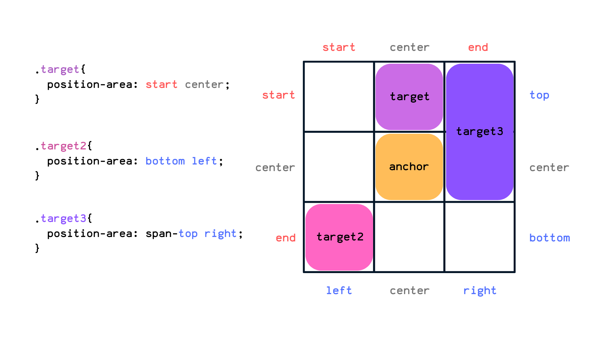

# 1.4 Creación de Menús y Submenús

El atributo `popovertarget` permite especificar un selector de destino para un popover. Esto es útil para crear menús y submenús interactivos que se abren y cierran dinámicamente.


### Ejemplo:

<style>
  [popover] {
    margin: 0;
    padding: 0;
    list-style: none;
    border: 1px solid #ccc;
    padding: 1rem;
    position: absolute;
    background-color: white;
    box-shadow: 0 4px 8px rgba(0, 0, 0, 0.1);
    width: 200px;
  }
  button[popovertarget] {
    cursor: pointer;
  }
  button.base {
    width: 100%;
    background-color: #fff;
    border: 0 solid #ccc;
    padding: 0;
    margin: 0;
    cursor: pointer;
    display: block;
    color: black;
    text-align: left;
    font-size: medium;
  }
  #anchor_2, .anchor_2 {
    anchor-name: --anchor_2;
  }
  [popover] {
    position: absolute;
    position-anchor: --anchor_2;
    top: anchor(--anchor_2 bottom);
    left: anchor(--anchor_2 right);
  }
</style>
<button id="anchor_2" popovertarget="popover_2">Abrir menú principal</button>
<ul id="popover_2" popover>
  <li>
    <div>
    <button class="base anchor_2" popovertarget="sub_popover_1">
      Elemento A
    </button>
    <ul id="sub_popover_1" popover>
      <li><a href="#">Sub-elemento A1</a></li>
      <li><a href="#">Sub-elemento A2</a></li>
    </ul>
    </div>
  </li>
  <li><a href="#">Elemento B</a></li>
  <li><a href="#">Elemento C</a></li>
</ul>


### 1. Menú Básico con Popover

El siguiente ejemplo muestra cómo crear un menú básico usando el atributo `popovertarget` para abrir un popover al hacer clic en un botón:

```html
<button id="anchor_1" popovertarget="popover_1">Abrir menú</button>
<ul id="popover_1" popover>
  <li><a href="#">Elemento 1</a></li>
  <li><a href="#">Elemento 2</a></li>
  <li><a href="#">Elemento 3</a></li>
</ul>
```

- **Explicación**:
  - El botón tiene un atributo `popovertarget` que apunta al popover (`<ul>` con `id="popover_1"`). Al hacer clic en el botón, se abre el popover.

### 2. Submenús Anidados

Podemos crear menús anidados (submenús) agregando más elementos de tipo popover a cada uno de los ítems del menú principal:

```html
<button id="anchor_2" popovertarget="popover_2">Abrir menú principal</button>
<ul id="popover_2" popover>
  <li>
    <a href="#">Elemento A</a>
    <button popovertarget="sub_popover_1">Abrir submenú</button>
    <ul id="sub_popover_1" popover>
      <li><a href="#">Sub-elemento A1</a></li>
      <li><a href="#">Sub-elemento A2</a></li>
    </ul>
  </li>
  <li><a href="#">Elemento B</a></li>
  <li><a href="#">Elemento C</a></li>
</ul>
```

- **Explicación**:
  - El submenú (`<ul id="sub_popover_1" popover>`) se muestra al hacer clic en el botón asociado (`popovertarget="sub_popover_1"`).

### 3. Estilos CSS para Menús Popover

Podemos agregar algunos estilos para mejorar la apariencia del menú y los submenús:

```css
[popover] {
  margin: 0;
  padding: 0;
  list-style: none;
  border: 1px solid #ccc;
  padding: 1rem;
  position: absolute;
  background-color: white;
  box-shadow: 0 4px 8px rgba(0, 0, 0, 0.1);
  width: 200px;
}
button[popovertarget] {
  cursor: pointer;
}
```

- **Explicación**:
  - Los menús popover (`[popover]`) tienen un fondo blanco y una sombra para dar la apariencia de una ventana flotante.
  - Los botones que abren los popovers (`button[popovertarget]`) tienen un cursor de puntero para indicar que son interactivos.


### 4. Anchors para Popovers

Los `anchors` se utilizan para posicionar de forma precisa el popover en relación con el elemento desencadenante (ancla). Esto es particularmente útil cuando deseas especificar de qué lado del botón debe aparecer el menú o submenú.

#### Ejemplo de Uso de Anchor

```html
<button id="anchor_3" popovertarget="popover_3" anchor-name="--anchor_3">Abrir popover con anchor</button>
<ul id="popover_3" popover>
  <li><a href="#">Opción 1</a></li>
  <li><a href="#">Opción 2</a></li>
  <li><a href="#">Opción 3</a></li>
</ul>

<style>
  #anchor_3 {
    anchor-name: --anchor_3;
  }
  [popover] {
    position: absolute;
    position-anchor: --anchor_3;
    top: anchor(--anchor_3 bottom);
    left: anchor(--anchor_3 right);
  }
</style>
```

- **Explicación**:
  - El atributo `anchor-name` define un nombre de ancla para el botón (`--anchor_3`), que luego se utiliza para posicionar el popover (`<ul id="popover_3" popover>`).
  - La propiedad CSS `position-anchor` permite que el popover se posicione respecto al elemento ancla (`--anchor_3`), y las propiedades `top` y `left` indican la posición específica relativa al ancla (en este caso, abajo y a la derecha del botón).

### 4.2 Anchor position-area



```html
<button id="anchor_area" popovertarget="popover-area">Abrir popover con anchor</button>
<ul id="popover-area" popover>
  <li><a href="#">Opción 1</a></li>
  <li><a href="#">Opción 2</a></li>
  <li><a href="#">Opción 3</a></li>
</ul>

<style>
  #anchor_area {
    anchor-name: --anchor_area;
  }
  [popover] {
    position: absolute;
    position-anchor: --anchor_area;
    position-area: span-top right;
  }
</style>
```

### 5. Resumen y Beneficios del Popover

El atributo `popovertarget` permite crear menús interactivos de una manera estándar y accesible, sin la necesidad de bibliotecas externas. La API de JavaScript proporciona un control detallado sobre cómo y cuándo se muestran estos elementos, mejorando la experiencia del usuario.

**Beneficios**:
- **Simplicidad**: No se necesitan bibliotecas externas para crear menús interactivos.
- **Accesibilidad**: Mejoran la accesibilidad gracias a su semántica estándar para navegadores y lectores de pantalla.
- **Flexibilidad**: Se pueden personalizar con CSS para adaptarse al diseño de la página.

### 6. Anchors y el soporte en firefox 🦊:

Por el momento los anchors no son soportados en Firefox, por lo que es importante tener en cuenta este detalle. Pero se puede usar un Polyfill para solucionar este problema.

- **document `<head>`**:
```html
<script type="module">
  if (!("anchorName" in document.documentElement.style)) {
    import("https://unpkg.com/@oddbird/css-anchor-positioning");
  }
</script>
```


